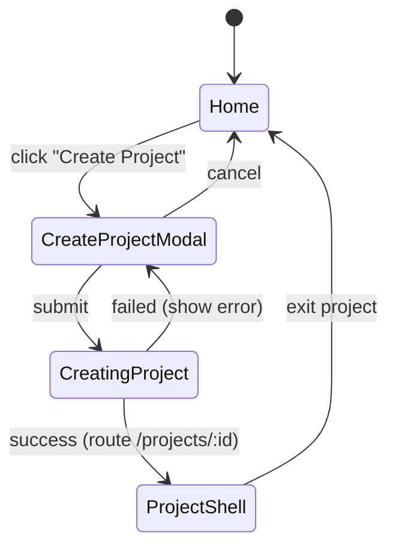
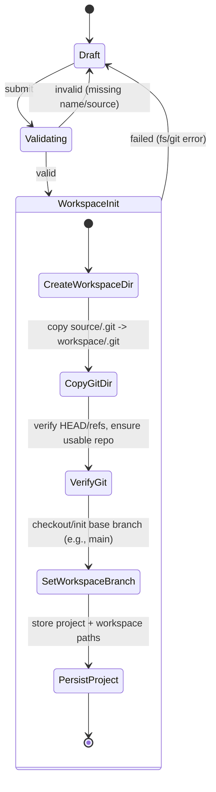
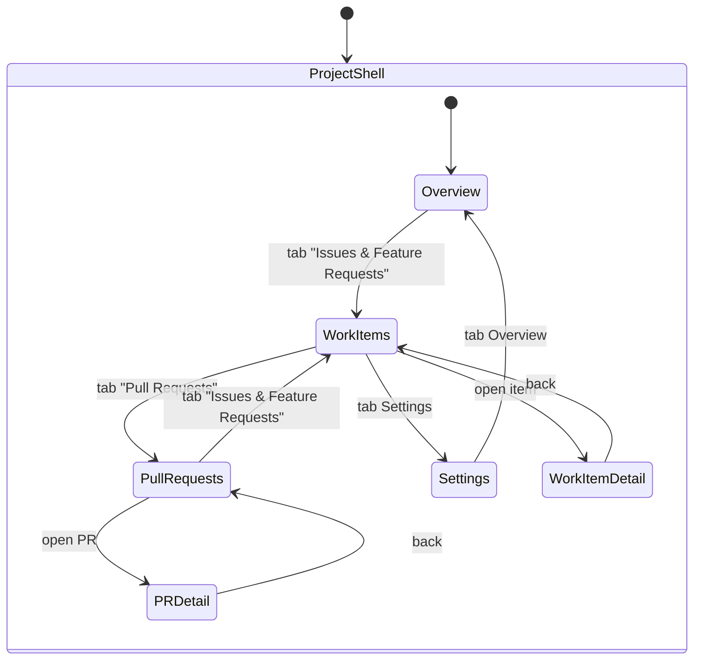
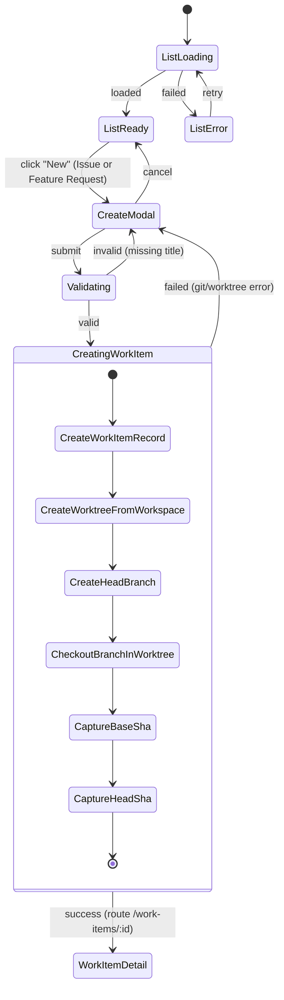
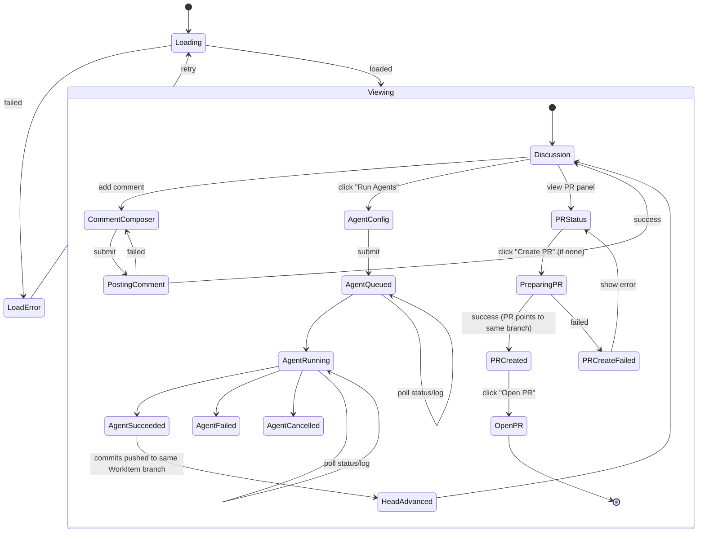
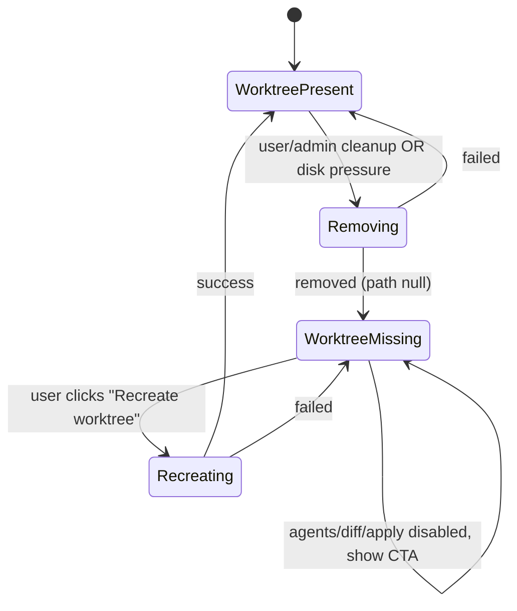

## Full project-centric (GitHub-like) state machine — with your rules

Rules integrated:

1. **After a PR is created, agent runs push commits to the same PR head branch** (PR updates in place).
2. **Issues also create worktrees and PRs** (not just Feature Requests).
3. **PR code review comments are handled in the corresponding worktree** (review actions may trigger agent work in that PR’s worktree/branch).

To avoid duplicating “Issue vs Feature Request” flows, I’ll model them as a single **WorkItem** type (kind = Issue | FeatureRequest) with identical automation behavior.

---

## 0) Mental model (what the state machine assumes)

- **Project** = workspace repo (created by copying `.git` from a source repo into a temp/workspace directory).
- A **WorkItem** (Issue/FeatureRequest) owns:
  - a **worktree + head branch** (created at WorkItem creation time)
  - **agent runs** that commit to that branch
  - optionally a **PR** (ChangeSet) whose head is that same branch
- A **PR** is always: `base = project.workspace_base_branch`, `head = workitem.branch`
- **PR review comments/threads** belong to the PR but are _actioned_ by agents in the same head branch/worktree.

---

## 1) Top level app (only Create Project)

---

## 2) Create Project (copy `.git` from source repo → workspace repo)

---

## 3) Project shell navigation (GitHub-like under Project)

---

## 4) WorkItem (Issue/Feature Request) lifecycle: create → worktree → agents → PR

### 4.1 WorkItem list + creation

**Key point:** Worktree is created **at WorkItem creation**, per your rule that issues also create worktrees/PRs.

---

### 4.2 WorkItem detail (discussion + agents + PR creation)

---

## 5) PR (ChangeSet) lifecycle: created from WorkItem branch, updated by agents, review comments handled via same worktree

This is the “full” part where your rule (agents keep pushing to same head branch) and “review comments deal in corresponding worktree” are explicit.

---

## 6) Worktree management (because everything depends on it)

Since you rely heavily on worktrees, you need explicit “worktree present/missing” gating. This applies to WorkItems and PRs (same underlying worktree/branch).

---

## 7) Cross-object coupling (the important invariants)

These are not “states” but they explain why the machine is structured this way:

- **WorkItem.branch == PR.head_branch** (if PR exists)
- Agent runs always target **that branch/worktree**
- PR is updated when agent run succeeds (new commits pushed)
- Review threads can become **outdated** when head moves
- Merging PR applies changes into the **workspace repo base branch**
