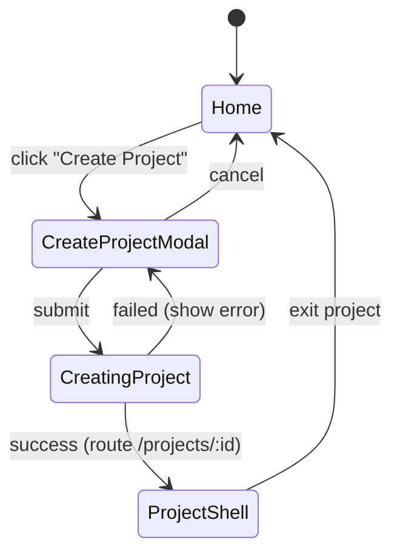
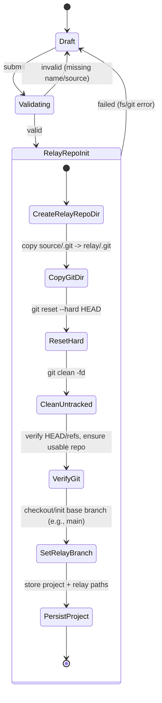
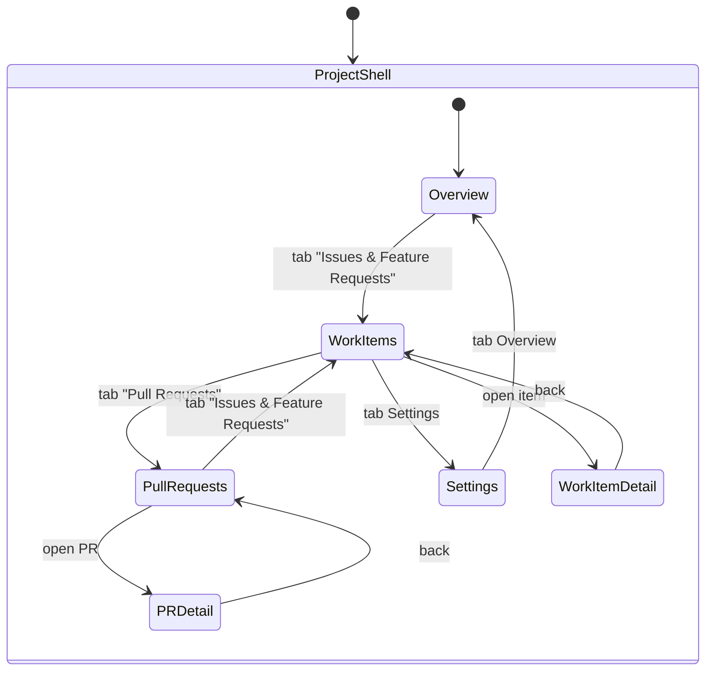
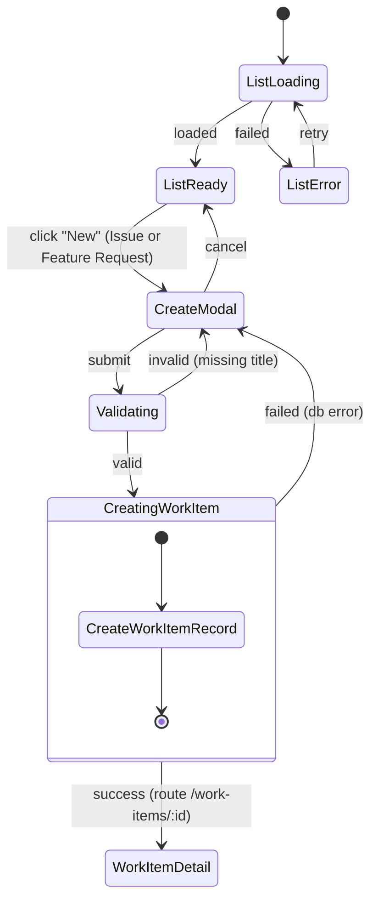
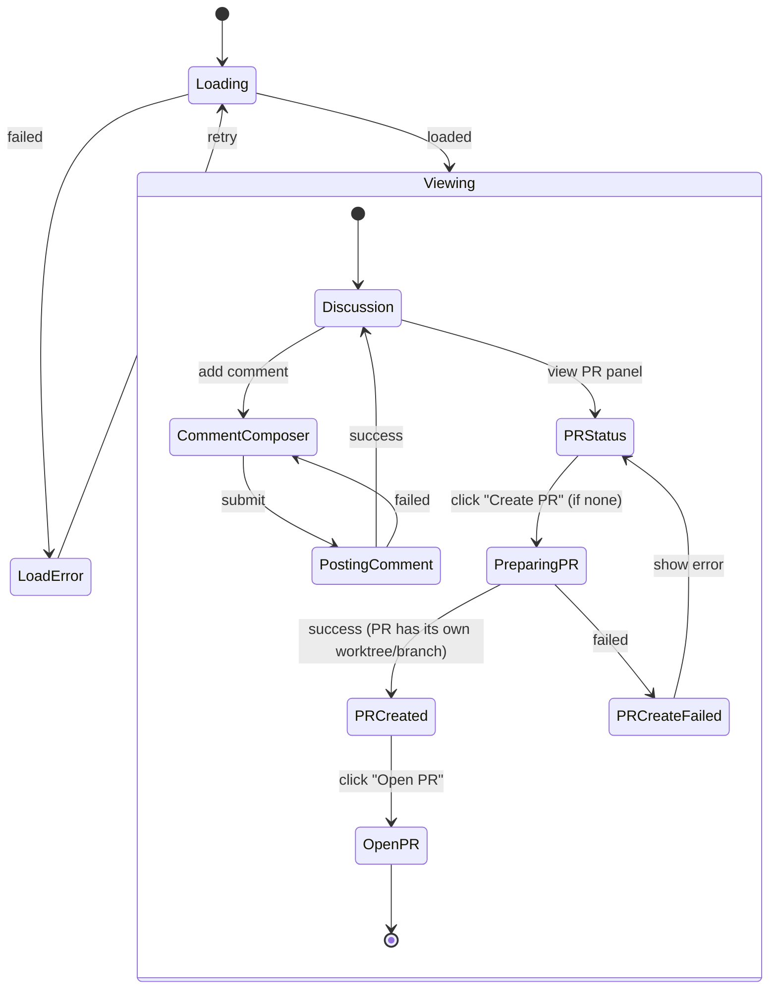
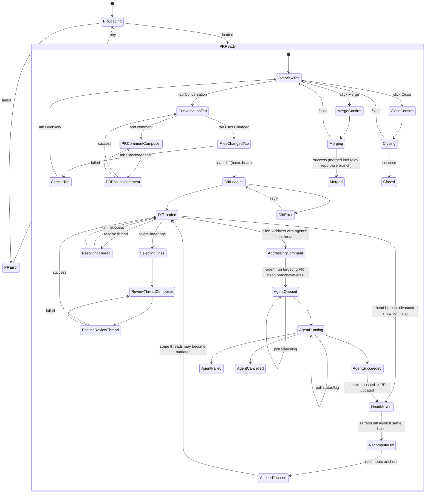
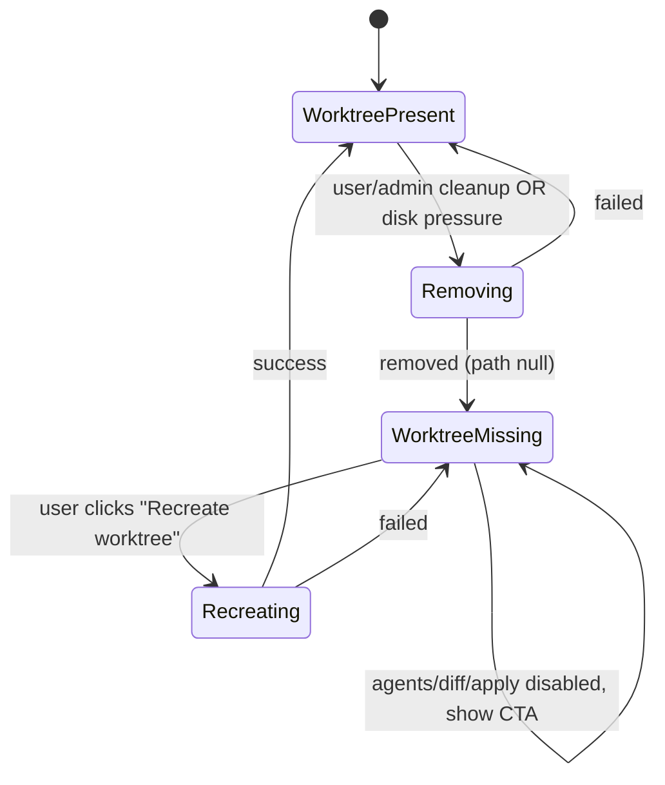

## Full project-centric (GitHub-like) state machine — with your rules

Rules integrated:

1. **After a PR (ChangeSet) is created, agent runs push commits to the same PR head branch** (PR updates in place).
2. **WorkItems are task definitions only** - they do NOT create worktrees or branches. WorkItems can create PRs (Changesets) which have their own worktrees.
3. **PR code review comments are handled in the corresponding worktree** (review actions may trigger agent work in that PR's worktree/branch).

To avoid duplicating “Issue vs Feature Request” flows, I’ll model them as a single **WorkItem** type (kind = Issue | FeatureRequest) with identical automation behavior.

---

## 0) Mental model (what the state machine assumes)

- **Source Repo** = original local Git repo (contains `.git`) that is the source of code.
- **Project** = a GitVibe project that creates a **Relay Repo** by copying `.git` from the source repo to `baseTempDir/projects/${project_name}` and running `git reset --hard` to restore files. This relay repo serves as the workspace for all operations.
- A **WorkItem** (Issue/FeatureRequest) is a **task definition only** - it contains title, body, type, and status. It does NOT have worktrees, branches, or SHAs.
- A **PR (ChangeSet)** owns:
  - a **worktree + head branch** (created at PR creation time from the relay repo)
  - **agent runs** that commit to that branch in the relay repo
  - optionally links to a **WorkItem** for traceability
  - **syncedAt** timestamp when synced to source repo (null if not synced yet)
- A **PR** is always: `base = relay_repo.default_branch`, `head = changeset.branch_name`
- **PR review comments/threads** belong to the PR but are _actioned_ by agents in the same head branch/worktree.
- **Sync to Source**: user manually syncs changes from the relay repo back to the source repo when ready. The sync creates a branch called `relay-${project_name}` in the source repo, copies all files from the relay repo to the source repo (excluding `.git` directory), stages the changes, and creates a commit. After successful sync, the changeset's `syncedAt` field is updated.
- **Pending Sync**: merged PRs that have `prStatus='merged'` but `syncedAt=null` are considered "pending sync" - they are merged in the relay repo but haven't been synced to the source repo yet.

---

## 1) Top level app (only Create Project)

---

## 2) Create Project (copy `.git` from source repo → relay repo)

---

## 3) Project shell navigation (GitHub-like under Project)

---

## 4) WorkItem (Issue/Feature Request) lifecycle: create → discussion → PR

**Note:** WorkItems do NOT create worktrees. WorkItems are task definitions only. PRs (Changesets) own worktrees, branches, and handle agent runs.

### 4.1 WorkItem list + creation

**Key point:** WorkItems are **task definitions only** - they do NOT create worktrees or branches. WorkItems can create PRs (Changesets) which have their own worktrees.

---

### 4.2 WorkItem detail (discussion + PR creation)

**Note:** WorkItems do NOT have worktrees. Agent runs and code changes happen in PRs (Changesets) which are created from WorkItems.

**Note:** Agent runs happen in the PR (ChangeSet) detail view, not in the WorkItem detail view. WorkItems are for discussion and task tracking only.

---

## 5) PR (ChangeSet) lifecycle: created from WorkItem (or independently), updated by agents, review comments handled via same worktree

This is the "full" part where your rule (agents keep pushing to same head branch) and "review comments deal in corresponding worktree" are explicit.

**Note:** PRs (Changesets) can be created independently without a WorkItem, but when created from a WorkItem, they link back for traceability. PRs own their own worktrees, branches, and SHAs.

---

## 6) Worktree management (because everything depends on it)

Since you rely heavily on worktrees, you need explicit "worktree present/missing" gating. This applies to PRs (Changesets) only, since WorkItems no longer have worktrees.

**Note:** Worktree management applies to PRs (Changesets) only, since WorkItems no longer have worktrees.

---

## 7) Cross-object coupling (the important invariants)

These are not "states" but they explain why the machine is structured this way:

- **WorkItems are task definitions only** - no worktree, branch, or SHA tracking
- **PRs (Changesets) own worktrees, branches, and SHAs**
- Agent runs always target **that PR's branch/worktree in relay repo**
- PR is updated when agent run succeeds (new commits pushed to relay repo)
- Review threads can become **outdated** when head moves
- Merging PR applies changes into the **relay repo base branch**
- **Pending Sync**: merged PRs (`prStatus='merged'`) with `syncedAt=null` are waiting to be synced to source repo
- User can manually sync changes from the **relay repo to source repo** (creates `relay-${project_name}` branch, copies files excluding `.git`, stages and commits changes, updates `syncedAt`)
