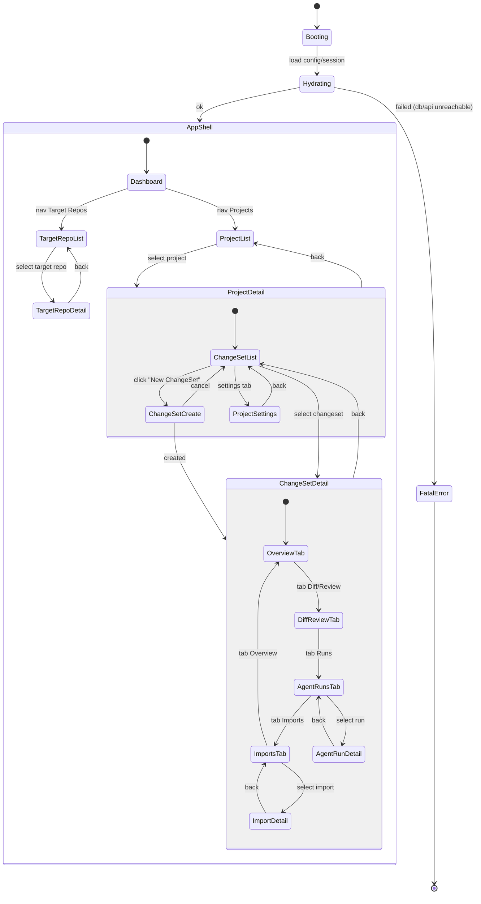
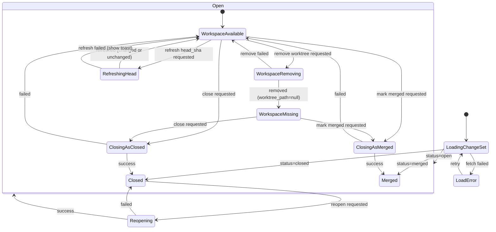
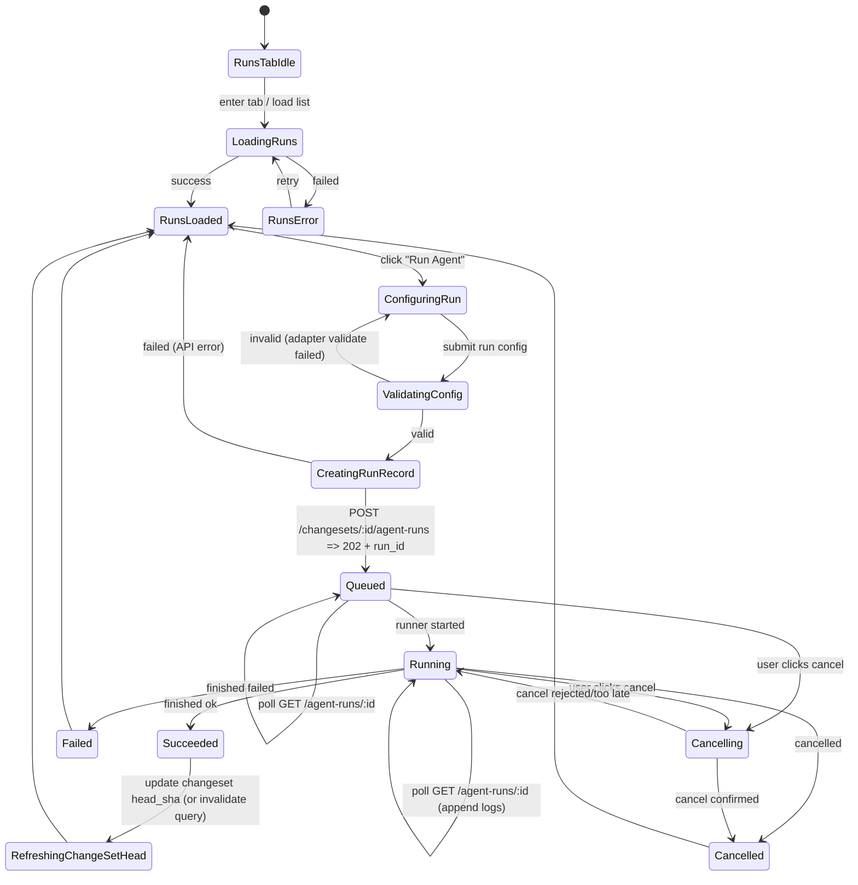
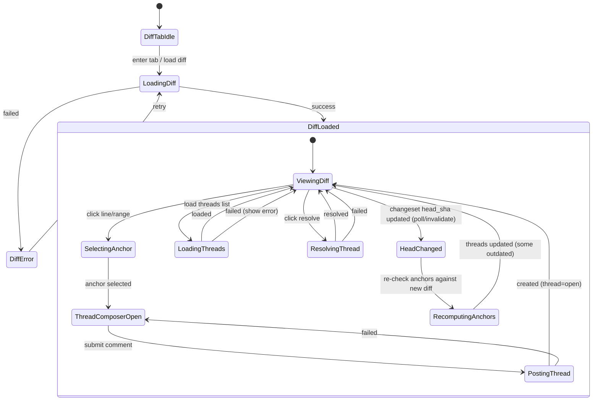

Below is a **full, expanded** state machine set (still aligned to `PLAN.md`)—no “v1/v2/optimized” labeling.

---

## 1) Application + Navigation (full)



---

## 2) ChangeSet creation (Issue/Feature Request) — full UI + backend mapping

Key alignment points to `PLAN.md`:
- Requires `title`, `base_branch`; `body` optional (plan says title/body but also “body optional recommended” is fine).
- On submit: backend resolves `base_sha`, creates worktree, sets initial `head_sha = base_sha`, persists ChangeSet.

```mermaid
stateDiagram-v2
  [*] --> Idle

  Idle --> OpeningForm: Click "New ChangeSet"
  OpeningForm --> Drafting: form shown

  state Drafting {
    [*] --> FormReady

    %% Fields (UI microstates)
    FormReady --> EditingTitle: focus title
    EditingTitle --> FormReady: blur title

    FormReady --> EditingBody: focus body
    EditingBody --> FormReady: blur body

    FormReady --> OpeningBranchSelector: open base_branch dropdown
    OpeningBranchSelector --> LoadingBranches: fetch branches
    LoadingBranches --> BranchListLoaded: success
    LoadingBranches --> BranchListError: failed
    BranchListError --> LoadingBranches: retry
    BranchListLoaded --> SelectingBranch: user selecting
    SelectingBranch --> FormReady: branch selected

    %% Optional draft persistence
    FormReady --> SavingDraft: autosave/manual save
    SavingDraft --> FormReady: saved
    SavingDraft --> DraftSaveError: failed
    DraftSaveError --> SavingDraft: retry
    DraftSaveError --> FormReady: dismiss error

    %% Validation + submit
    FormReady --> Validating: submit
    Validating --> FormReady: invalid (missing title/base_branch)
    Validating --> Submitting: valid
  }

  state Submitting {
    [*] --> PostingChangeSet
    PostingChangeSet --> CreatingWorktree: API accepted (job started)
    CreatingWorktree --> Created: worktree created + base_sha + head_sha
    CreatingWorktree --> CreateFailed: git/api error
    CreateFailed --> Drafting: show error + allow retry/edit
  }

  Created --> NavigatingToDetail: route to /changesets/:id
  NavigatingToDetail --> [*]
```

---

## 3) ChangeSet lifecycle (full, including worktree availability + close/cleanup)

This models:
- durable ChangeSet status (`open/merged/closed`)
- worktree may be removed (worktree_path becomes null)
- head refresh
- “reopen” is optional (your earlier diagrams had it; `PLAN.md` doesn’t require it, but it’s safe to model if you implement)



---

## 4) Agent runs (full job model + UI polling/log streaming)

Aligns to `PLAN.md` statuses and fields: `queued/running/succeeded/failed/cancelled` and `head_sha_before/after`.



---

## 5) Diff + Review threads (full, including “outdated” on head changes)

Aligns to `PLAN.md`:
- diff is `base_sha..head_sha`
- threads anchored to diff
- thread can become `outdated` when head changes and anchor no longer matches



---

## 6) Import (patch) flow (full, including no-op + dirty target + conflict)

Aligns exactly to `PLAN.md` section 6:
- refresh source head
- generate patch
- if empty => succeeded, no commit
- check target clean
- apply 3-way, commit, record SHAs/logs

```mermaid
stateDiagram-v2
  [*] --> ImportsTabIdle

  ImportsTabIdle --> LoadingImports: enter tab / load history
  LoadingImports --> ImportsLoaded: success
  LoadingImports --> ImportsError: failed
  ImportsError --> LoadingImports: retry

  ImportsLoaded --> ConfiguringImport: click "Import (Patch)"
  ConfiguringImport --> ValidatingImport: select target_repo + confirm
  ValidatingImport --> ConfiguringImport: invalid (missing target_repo)
  ValidatingImport --> StartingImport: POST /changesets/:id/imports => 202 import_id

  StartingImport --> ImportRunning: job running

  %% UI polling
  ImportRunning --> ImportRunning: poll GET /imports/:id (status/log)

  %% Outcomes (backend-driven)
  ImportRunning --> ImportSucceeded: applied + committed (target_result_sha set)
  ImportRunning --> ImportSucceededNoop: empty patch ("nothing to import")
  ImportRunning --> ImportFailedDirtyTarget: target repo not clean (409)
  ImportRunning --> ImportFailedConflict: apply --3way conflict (409)
  ImportRunning --> ImportFailedOther: unexpected failure

  %% Retry path
  ImportFailedDirtyTarget --> ImportsLoaded: user fixes target + retries
  ImportFailedConflict --> ImportsLoaded: user resolves manually + retries (or abort)
  ImportFailedOther --> ImportsLoaded: retry

  ImportSucceeded --> ImportsLoaded
  ImportSucceededNoop --> ImportsLoaded
```


