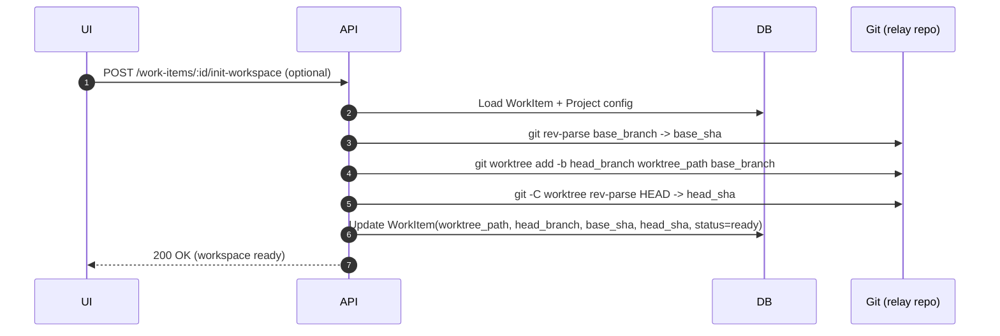
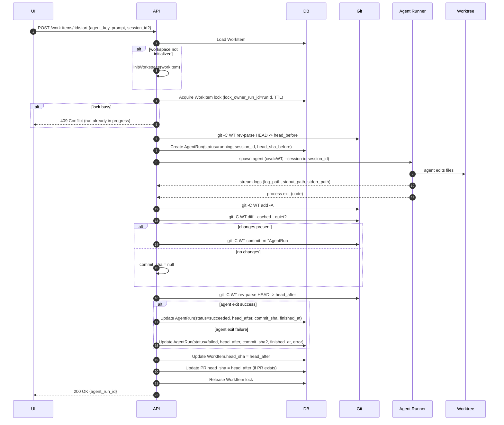
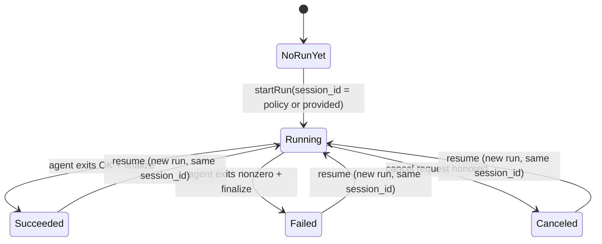
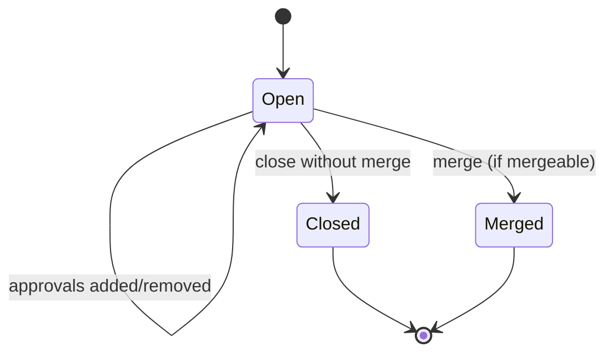

# GitVibe — PLAN.md (Refactored, PR-centric, WorkItem Workspace)

> **Status**: Implementation complete for MVP scope. This document describes the architecture and design principles.
> **Audience**: engineers maintaining or extending GitVibe.
> **Version**: 0.1.0
> **Goal**: a GitHub-like agent coding management system where **each WorkItem owns a single persistent workspace** (git worktree + branch), **agent runs are serialized**, **backend auto-commits after each run**, and **merge is controlled via a first-class Pull Request model**.

---

## 0) Core Principles

1. **One WorkItem = one workspace**
   - A workspace is a git worktree checked out on a dedicated branch.
   - The workspace persists across multiple agent runs.

2. **PR-first UX**
   - Users work through a Pull Request view: diffs, commits, checks (agent runs), approvals, and merge controls.
   - A WorkItem typically has exactly one PR (1:1 by default).

3. **No concurrent agent runs per WorkItem**
   - Enforced with a lock at the WorkItem level.
   - Merge operations also coordinate with this lock.

4. **Backend auto-commits after each agent run**
   - Agents may edit files freely. At run end, backend stages + commits changes (if any).
   - This produces a clean commit history and stable PR diffs.

5. **sessionId is required**
   - Every AgentRun has a `session_id` determined **before** launching the agent.
   - For Claude Code (and similar), we pass `--session-id=<session_id>` at launch.
   - Resume is implemented by re-launching with the same session_id (agent-specific semantics).

6. **Single source of truth for "running state"**
   - Running state is driven by `agent_runs.status`.
   - WorkItem/PR statuses represent lifecycle, not execution.

---

## 1) Domain Model (Concepts)

### 1.1 WorkItem
Represents a unit of work and owns a persistent workspace.

**Key responsibilities**
- Own the workspace (worktree path + head branch)
- Provide a stable target for agent runs
- Provide metadata for PR creation and review

### 1.2 Pull Request (PR)
A first-class entity controlling review and merge.

**Key responsibilities**
- Define base and head (branch and/or SHA)
- Render diff and commits
- Track approvals and merge gates
- Execute merge into base branch under controlled rules

### 1.3 AgentRun
An immutable-ish execution record per run attempt.

**Key responsibilities**
- Track status, logs, timestamps
- Record head SHA before and after
- Persist `session_id` (required)
- Associate to a WorkItem (and indirectly to its PR)

### 1.4 TargetRepo
A destination repository for importing patches.

**Key responsibilities**
- Store target repository path and default branch
- Track import history from PRs

---

## 2) High-level User Workflow

1. Create WorkItem
2. Initialize workspace (explicit or implicit)
3. Open PR (often auto-created)
4. Trigger AgentRun(s) until satisfied
5. Review PR diff/commits, optionally approve
6. Merge PR (squash/merge/rebase)
7. Close WorkItem / PR lifecycle completed
8. (Optional) Import patch to target repository

---

## 3) Git Model & Repository Layout

### 3.1 Repositories
GitVibe uses a **relay repository** (local or server-side) as the execution environment:
- Holds a clone of the "project repo" (or a managed repo)
- Creates worktrees for WorkItems
- Runs agents in worktrees
- Performs merges in the relay repo

> If you later integrate with GitHub-hosted PRs, you can map this PR model to GitHub via API.
> This PLAN assumes GitVibe controls the repo locally (relay) for simplicity and reliability.

### 3.2 Branch Strategy
- Base branch: typically `main` (configurable per project via `default_branch`)
- WorkItem head branch: `wi/<work_item_id>` (deterministic, same WorkItem always gets same branch)
- Worktree directory: `<storage_base_dir>/worktrees/<work_item_id>/`

### 3.3 Base SHA Strategy
PR diff correctness depends on base selection.

Recommended:
- On PR creation, store a **frozen `base_sha`** from `base_branch`.
- Allow explicit "Update base" action later if desired.

---

## 4) Persistence Model (Tables)

> Names are suggestions; adjust to your stack.
> Use UUIDs if preferred; examples use integer IDs for readability.

### 4.1 projects
- `id` (UUID)
- `name` (unique)
- `source_repo_path` (path to source repository)
- `source_repo_url` (optional, for reference)
- `relay_repo_path` (path to relay repo clone)
- `default_branch` (e.g., `main`)
- `default_agent` (e.g., `opencode`, `claudecode`)
- `agent_params` (JSON string for agent configuration)
- `max_agent_concurrency` (default: 3)
- timestamps

### 4.2 work_items
- `id` (UUID)
- `project_id` (foreign key)
- `type` (`issue` | `feature-request`)
- `title`
- `body` (optional description)
- `status` (`open` | `closed`)
- **workspace fields**
  - `workspace_status` (`not_initialized` | `ready` | `error`)
  - `worktree_path` (unique)
  - `head_branch` (unique within project, format: `wi/<work_item_id>`)
  - `base_branch` (from project default)
  - `base_sha` (set when workspace initialized)
  - `head_sha` (cached; update after runs and on demand)
- **locking fields** (to serialize runs/merge)
  - `lock_owner_run_id` (nullable)
  - `lock_expires_at` (nullable; for crash recovery)
- timestamps

Constraints:
- unique `(project_id, head_branch)` (enforced via index)
- unique `worktree_path` (enforced via index)

### 4.3 pull_requests
- `id` (UUID)
- `project_id` (foreign key)
- `work_item_id` (unique, enforcing 1:1 by default)
- `title` (from work item)
- `description` (from work item body)
- `status` (`open` | `merged` | `closed`)
- `source_branch` (from work item head_branch)
- `target_branch` (from work item base_branch)
- `merge_strategy` (`merge` | `squash` | `rebase`, default: `merge`)
- `merged_at` (nullable)
- `merged_by` (nullable, currently 'system')
- `merge_commit_sha` (nullable)
- `synced_commit_sha` (nullable, for source repo sync)
- timestamps

Constraints:
- unique `work_item_id` (enforced)

Note: Base SHA and head SHA are tracked in the WorkItem, not duplicated in PR table.

### 4.4 agent_runs
- `id` (UUID)
- `project_id` (foreign key)
- `work_item_id` (foreign key)
- `agent_key` (e.g., `opencode`, `claudecode`)
- `session_id` (required; WorkItem-scoped by default: `wi-<work_item_id>`)
- `status` (`queued` | `running` | `succeeded` | `failed` | `cancelled`)
- `input_summary` (truncated prompt for display)
- `input_json` (full prompt and config as JSON)
- `linked_agent_run_id` (nullable, for resume/correction chains)
- `log` (text, for small logs)
- `log_path` (file path for large logs)
- `stdout_path` (file path for stdout)
- `stderr_path` (file path for stderr)
- `head_sha_before` (SHA before run)
- `head_sha_after` (SHA after auto-commit; may equal before if no changes)
- `commit_sha` (the auto-commit SHA if created; nullable if no changes)
- `started_at` (nullable)
- `finished_at` (nullable)
- timestamps

Indexes:
- `(work_item_id)` (for listing runs per work item)
- `(session_id)` (for session-based queries)
- `(status)` (for filtering by status)

### 4.5 review_threads
- `id` (UUID)
- `pull_request_id` (foreign key)
- `status` (`open` | `resolved` | `outdated`)
- `severity` (`info` | `warning` | `error`)
- `anchor` (file path and line reference, JSON stringified)
- timestamps

### 4.6 review_comments
- `id` (UUID)
- `thread_id` (foreign key)
- `body` (comment text)
- timestamps

### 4.7 target_repos
- `id` (UUID)
- `name`
- `repo_path` (unique, path to target repository)
- `default_branch`
- timestamps

### 4.8 imports
- `id` (UUID)
- `pull_request_id` (foreign key)
- `target_repo_id` (foreign key)
- `strategy` (`patch` - currently only patch strategy)
- `status` (`pending` | `running` | `succeeded` | `failed`)
- `source_base_sha` (from PR base)
- `source_head_sha` (from PR head)
- `target_base_sha` (target repo SHA before import)
- `target_result_sha` (target repo SHA after import)
- `log` (import log text)
- `started_at` (nullable)
- `finished_at` (nullable)
- timestamps

### 4.9 approvals (optional MVP+)
- `id`
- `pull_request_id`
- `user_id`
- `state` (`approved` | `rejected`)
- timestamps

---

## 5) API Surface (Minimal)

### 5.1 Projects
- `GET /api/projects` - List all projects with pagination
- `POST /api/projects` - Create a project
- `GET /api/projects/:id` - Get project details
- `PATCH /api/projects/:id` - Update project settings
- `DELETE /api/projects/:id` - Delete a project
- `POST /api/projects/:id/sync` - Sync relay repo with source repo
- `GET /api/projects/:id/branches` - List branches
- `GET /api/projects/:id/files` - List repository files
- `GET /api/models` - List available agent models
- `POST /api/models/refresh` - Refresh model cache

### 5.2 Target Repos
- `GET /api/target-repos` - List all target repos
- `POST /api/target-repos` - Create a target repo
- `GET /api/target-repos/:id` - Get target repo details

### 5.3 WorkItems
- `GET /api/workitems` - List work items with optional project filter and pagination
- `POST /api/projects/:projectId/work-items` - Create a work item
- `GET /api/workitems/:id` - Get work item details
- `PATCH /api/workitems/:id` - Update work item
- `DELETE /api/workitems/:id` - Delete work item
- `POST /api/work-items/:id/init-workspace` - Initialize workspace (optional)
- `POST /api/workitems/:id/start` - Start agent run
- `POST /api/workitems/:id/resume` - Resume task with same session_id
- `GET /api/workitems/:id/tasks` - List all runs for work item
- `POST /api/workitems/:id/tasks/:taskId/cancel` - Cancel running task
- `POST /api/workitems/:id/tasks/:taskId/restart` - Restart task with same prompt
- `GET /api/workitems/:id/tasks/:taskId/status` - Get task status
- `GET /api/workitems/:id/prs` - Get PRs for work item
- `POST /api/workitems/:id/create-pr` - Create PR from work item

### 5.4 Pull Requests
- `GET /api/pull-requests` - List PRs (with optional project filter and pagination)
- `GET /api/pull-requests/:id` - Get PR details
- `GET /api/pull-requests/:id/diff` - Get PR diff
- `GET /api/pull-requests/:id/commits` - Get PR commits
- `GET /api/pull-requests/:id/commits-with-tasks` - Get PR commits grouped by tasks
- `GET /api/pull-requests/:id/statistics` - Get PR statistics
- `POST /api/pull-requests/:id/merge` - Merge PR
- `POST /api/pull-requests/:id/close` - Close PR without merge
- `POST /api/pull-requests/:id/update-base` - Update base branch and optionally rebase
- `GET /api/pull-requests/:id/patch` - Export patch (optional)

### 5.5 Agent Runs
- `GET /api/agent-runs/:id` - Get run status and logs
- `POST /api/agent-runs/:id/cancel` - Cancel running agent
- `GET /api/agent-runs/:id/stdout` - Get stdout log
- `GET /api/agent-runs/:id/stderr` - Get stderr log
- `GET /api/agent-runs/:id/logs` - Get both stdout and stderr logs

### 5.6 Reviews
- `GET /api/pull-requests/:id/reviews/threads` - List review threads
- `POST /api/pull-requests/:id/reviews/threads` - Create thread
- `GET /api/pull-requests/:id/reviews/threads/:threadId` - Get thread details
- `POST /api/pull-requests/:id/reviews/threads/:threadId/resolve` - Resolve thread
- `POST /api/pull-requests/:id/reviews/threads/:threadId/unresolve` - Unresolve thread
- `POST /api/pull-requests/:id/reviews/threads/:threadId/comments` - Add comment
- `POST /api/pull-requests/:id/reviews/threads/:threadId/address` - Address with agent
- `POST /api/pull-requests/:id/reviews/threads/:threadId/resume` - Resume from thread

---

## 6) Workspace Initialization (Deterministic & Idempotent)

### 6.1 When to init
Recommended default:
- Initialize workspace automatically on the first AgentRun request
- Still provide explicit init endpoint for admin/troubleshooting

### 6.2 Initialization steps (relay repo)
Given `project.repo_path` and `work_item`:

1. Ensure relay repo is present and clean enough for operations.
2. Fetch/refresh base branch if needed.
3. Resolve base SHA:
   - `base_sha = git rev-parse <base_branch>`
4. Create head branch name:
   - `head_branch = "wi/<workItemId>"`
5. Create worktree:
   - `git worktree add -b <head_branch> <worktree_path> <base_branch>`
6. Persist:
   - `worktree_path, head_branch, base_branch, base_sha, head_sha=base_sha`
   - `workspace_status=ready`

Idempotency:
- If worktree exists and is valid, return success and refresh `head_sha`.

---

## 7) AgentRun Execution Model (Serialized per WorkItem)

### 7.1 Locking
Before starting a run:
- Acquire WorkItem lock:
  - if `lock_owner_run_id` is set and not expired → reject (409 Conflict)
  - else set `lock_owner_run_id = runId` and `lock_expires_at = now + TTL`
- Refresh TTL heartbeat periodically while running
- Release lock in `finally` on success/failure/cancel

Also enforce:
- Only one `agent_runs.status in (queued, running)` per work item.

### 7.2 session_id policy
session_id must be known before spawning the agent.

Recommended default policy options (pick one and document it):
- **WorkItem-scoped session** (best for "continuous conversation"):
  - `session_id = "wi-" + work_item_id`
- **Run-scoped session** (best for strict audit isolation):
  - `session_id = "run-" + agent_run_id`

This PLAN assumes **WorkItem-scoped** unless caller overrides.

### 7.3 Run steps (Implementation)
1. Check project concurrency limit (enforced per project, not just per WorkItem)
2. Ensure workspace initialized (`worktree_path` exists via `ensureWorkspace`)
3. Acquire WorkItem lock (with TTL for crash recovery)
4. Determine `head_sha_before = git rev-parse HEAD` in worktree
5. Create AgentRun row with `status=running`, `session_id`, `head_sha_before`
6. Spawn agent asynchronously with:
   - CWD = worktree_path
   - Agent-specific arguments (e.g., `--session-id` for ClaudeCode)
   - Logs streamed to files (`log_path`, `stdout_path`, `stderr_path`)
7. Agent adapter handles process lifecycle and updates status
8. On agent completion (via adapter callback):
   - Call `finalizeAgentRun()`:
     - Stage changes: `git add -A`
     - Check if staged changes exist
     - If changes: commit with message `AgentRun <id>: <input_summary>`
     - Capture `commit_sha` and `head_sha_after`
   - Update AgentRun: status, finished_at, head_sha_after, commit_sha
   - Update WorkItem cached `head_sha`
   - Release lock and untrack from project concurrency
9. Error handling: On failure, still attempt finalization but mark status as `failed`

### 7.4 Failure behavior
If agent fails:
- Still attempt to capture logs
- Still attempt to stage/commit? Recommended:
  - **Do NOT auto-commit on failure** by default to avoid committing partial changes.
  - Provide an admin setting `commit_on_failure` if you want.
- Leave workspace as-is for debugging/resume.

---

## 8) PR Diff, Commits, and Review

### 8.1 Diff computation
PR diff is computed from frozen base SHA to current head SHA:
- `git diff --no-color <base_sha>..<head_sha>`

### 8.2 Commits list
Option A (simple):
- `git log --oneline <base_sha>..<head_sha>`

Option B (more GitHub-like):
- compute merge-base and list commits reachable from head not from base.

### 8.3 Review gates (MVP)
Define a mergeability function that returns:
- `mergeable: true/false`
- `reasons: []` (strings)

Minimal checks:
- PR.status == open
- No AgentRun running for WorkItem
- Workspace lock is free
- Head is not behind base in a conflicting way (optional)
- No conflicts when merging head into base (recommended)

---

## 9) Merge Implementation (PR is the control plane)

### 9.1 Coordination with AgentRun
Merging must coordinate with WorkItem lock:
- Acquire the same WorkItem lock for merge
- Reject merge if a run is currently running

### 9.2 Merge strategies
Given PR `base_branch`, `head_branch` in relay repo.

#### Strategy: merge commit
- `git checkout <base_branch>`
- `git merge --no-ff <head_branch> -m "Merge PR #<id>: <title>"`
- record `merge_commit_sha`

#### Strategy: squash
- `git checkout <base_branch>`
- `git merge --squash <head_branch>`
- `git commit -m "Squash PR #<id>: <title>"`
- record `merge_commit_sha`

#### Strategy: rebase
- `git checkout <head_branch>`
- `git rebase <base_branch>`
- `git checkout <base_branch>`
- `git merge --ff-only <head_branch>`
- record resulting base HEAD as merge sha

### 9.3 Conflict handling
Before merge, test mergeability:
- `git checkout <base_branch>`
- `git merge --no-commit --no-ff <head_branch>` (dry-ish)
- If conflicts:
  - abort `git merge --abort`
  - return mergeable=false with reason `conflicts`
- If no conflicts:
  - abort (if just testing) and proceed with chosen strategy

### 9.4 Post-merge updates
- Set PR status to `merged`
- Set WorkItem status optionally to `closed`
- Update cached SHAs
- Optionally clean up workspace:
  - keep worktree for audit, or
  - prune worktree after merge (configurable)

---

## 10) Mermaid Diagrams (Agent Workflow & PR Lifecycle)

### 10.1 Overall System Flow
```mermaid
flowchart TB
  U[User] --> UI[GitVibe UI]
  UI --> API[GitVibe API]
  API --> DB[(Database)]
  API --> GIT[Relay Git Repo]
  API --> AG[Agent Runner]
  AG -->|reads/writes| WT[Worktree (WorkItem Workspace)]
  WT --> GIT
  API --> UI
```

### 10.2 WorkItem Workspace Initialization


### 10.3 AgentRun (Serialized) — Detailed


### 10.4 Resume Semantics (sessionId-driven)


> Note: "resume" creates a **new AgentRun** record but reuses the same session_id.
> This keeps execution history immutable and audit-friendly while enabling conversation continuity.

### 10.5 PR Lifecycle & Merge Gate


```mermaid
flowchart LR
  A[Merge button pressed] --> B{PR status == open?}
  B -- no --> X[Reject]
  B -- yes --> C{Any AgentRun running?}
  C -- yes --> X
  C -- no --> D{Conflicts when merging head into base?}
  D -- yes --> X
  D -- no --> E{Approvals satisfied? (optional)}
  E -- no --> X
  E -- yes --> F[Perform merge strategy]
  F --> G[Mark PR merged, write merge_commit_sha]
```

---

## 11) Implementation Notes (Pragmatic)

### 11.1 Deterministic commit messages
For auto-commits, use a consistent format:
- `AgentRun <id>: <input_summary>`
Where `input_summary` is the first 200 characters of the prompt. Full prompt and config stored in `input_json`.

### 11.2 Large logs
Prefer `log_path`, `stdout_path`, and `stderr_path` on disk with rotation; store a small tail in DB if needed.

### 11.3 Lock TTL and crash recovery
- Use a TTL on the WorkItem lock (default: 6 hours)
- Lock is released in `finally` block after agent completion
- If TTL expires, new runs can acquire lock (previous run may be marked as failed if detected)
- Current implementation: Lock released immediately after finalization, no heartbeat renewal (simplified)

### 11.4 Security
- Run agents in a sandbox where possible
- Validate prompts/instructions storage (PII/secret handling)
- Restrict file system scope to worktree

### 11.5 Storage Configuration
Storage paths are configurable via environment variables:
- `STORAGE_BASE_DIR`: Base directory for all GitVibe data
- Defaults to system temp directory (`/tmp/git-vibe` on Unix, `%TEMP%\git-vibe` on Windows)

---

## 12) Implementation Status

### ✅ MVP Scope (Complete)

**Core Features**
- ✅ WorkItem CRUD
- ✅ Workspace init (implicit on first agent run)
- ✅ PR open + PR view (diff + commits)
- ✅ AgentRun start + logs + status
- ✅ Backend auto-commit (after successful runs)
- ✅ WorkItem lock (no concurrent run per WorkItem)
- ✅ Merge (all three strategies: merge, squash, rebase) with conflict detection
- ✅ Project-level concurrency limits (configurable per project)
- ✅ Multiple agent adapters (OpenCode, ClaudeCode)
- ✅ Session-based resume functionality
- ✅ Review threads and comments
- ✅ Patch import to source repositories
- ✅ Agent run cancellation
- ✅ Update base / rebase PR functionality
- ✅ Patch export endpoint (GET /pull-requests/:id/patch)

**Additional Features Implemented**
- ✅ Models cache for agent adapters
- ✅ Review comment addressing (agent correction)
- ✅ Import job tracking and history
- ✅ Worktree cleanup on WorkItem deletion
- ✅ Comprehensive error handling and logging
- ✅ Separate stdout/stderr log files
- ✅ Git relay repository support
- ✅ Source repository sync functionality

### 🔄 Nice-to-have (Future Enhancements)
- Approvals / required reviewers
- GitHub integration (sync PR / statuses)
- Distributed runners across machines (job queue + remote workspace)
- Multiple workspaces per WorkItem (non-goal for MVP)
- Real-time log streaming via WebSocket
- File browser in worktree
- Inline code editing in UI

---

## 13) Non-goals (for initial release)
- Multiple workspaces per WorkItem
- Concurrent agents on the same WorkItem (enforced by lock)
- Fully GitHub-compatible review comment threading (basic threading implemented)
- Distributed runners across machines (add later with job queue + remote workspace)
- User authentication/authorization (single-user local-first design)
- Webhooks or external integrations (can be added later)

---

## 14) Current Implementation Details

### 14.1 Tech Stack

**Backend**
- Node.js 20+ + TypeScript
- Fastify web framework
- SQLite database with Drizzle ORM
- Git CLI integration
- Agent adapter system (OpenCode, ClaudeCode)
- Zod for validation

**Frontend**
- React 18 + TypeScript
- Vite build tool
- TanStack Query for data fetching
- TanStack Router for routing
- Tailwind CSS for styling
- React Hook Form for forms
- Lucide React for icons

**Shared**
- TypeScript types and Zod schemas
- Shared between backend and frontend

### 14.2 Agent Adapters
Two agent adapters are implemented:
- **OpenCodeAgentAdapter**: For OpenCode CLI agent
- **ClaudeCodeAgentAdapter**: For Claude Code agent

Both extend `AgentAdapter` base class and implement:
- `validate()`: Check executable availability
- `run()`: Execute agent with prompt
- `correctWithReviewComments()`: Resume/correct with review feedback
- `getModels()`: List available models
- `cancel()`: Cancel running process
- `getStatus()`: Check run status

### 14.3 Project Concurrency
Projects have a `max_agent_concurrency` setting (default: 3) that limits concurrent agent runs across all WorkItems in a project. This is tracked in-memory by `AgentService`.

### 14.4 Storage Configuration
Storage paths are configurable via environment variables:
- `STORAGE_BASE_DIR`: Base directory for all GitVibe data
- Defaults to system temp directory (`/tmp/git-vibe` on Unix, `%TEMP%\git-vibe` on Windows)

Directory structure:
```
git-vibe/
├── data/
│   └── db.sqlite       # SQLite database
├── logs/               # Agent run logs
│   ├── agent-run-<id>.log
│   ├── agent-run-<id>-stdout.log
│   └── agent-run-<id>-stderr.log
└── worktrees/          # Git worktrees for WorkItems
    └── <work_item_id>/  # WorkItem workspace
```

### 14.5 Database Migrations
Two migration systems supported:
1. **Drizzle Kit migrations** (recommended): Uses `drizzle-kit generate` and `drizzle-orm/migrator`
2. **Raw SQL migrations**: Fallback for `.sql` files in `drizzle/` directory

Migration system auto-detects which to use based on presence of `drizzle/meta/_journal.json`.

### 14.6 Git Service Architecture
Git operations are organized into specialized services:
- **GitService**: Main facade for all Git operations
- **GitWorktreeService**: Worktree-specific operations
- **GitCommitService**: Commit, log, and diff operations
- **GitFileService**: File listing and content operations
- **GitRelayService**: Relay repository operations

This separation provides better organization and testability.

### 14.7 Frontend Architecture
The frontend is organized into:
- **Routes**: TanStack Router routes for pages
- **Components**: Reusable UI components organized by feature
- **Hooks**: Custom React hooks for data fetching and state management
- **Lib**: API client and utility functions

Key components:
- Project shell with tab navigation (Overview, Code, Pull Requests, WorkItems, Settings, Actions)
- PR detail view with tabs (Overview, Diff, Commits, Files Changed, Checks, Reviews)
- WorkItem detail view with tabs (Discussion, Log Detail, PR Status, Task Management, Agent Config)
- Diff viewer for code changes
- Review thread composer and management

---

## 15) Development Workflow

### 15.1 Setup
```bash
# Install dependencies
npm run install:all

# Run database migrations
npm run db:migrate

# Start development servers
npm run dev
```

This starts:
- Backend API server at `http://127.0.0.1:11031`
- Frontend UI at `http://localhost:11990`

### 15.2 Building
```bash
# Build all packages
npm run build

# Build individual packages
npm run build:backend
npm run build:frontend
npm run build:shared
```

### 15.3 Testing
```bash
# Run tests (Vitest)
cd backend && npm test

# Run tests once
cd backend && npm run test:run
```

### 15.4 Linting and Formatting
```bash
# Lint all packages
npm run lint

# Format all packages
npm run format

# Lint/format individual packages
npm run lint:backend
npm run format:backend
# etc.
```

---

## 16) API Reference

See the separate API documentation or the frontend `api.ts` file for complete API reference.

Key endpoints:
- Projects: `/api/projects`
- Target Repos: `/api/target-repos`
- WorkItems: `/api/workitems`
- Pull Requests: `/api/pull-requests`
- Agent Runs: `/api/agent-runs`
- Reviews: `/api/pull-requests/:id/reviews`

---

## 17) Troubleshooting

### 17.1 Agent Not Found
If you get "Executable not found" errors:
1. Verify the agent executable is in your PATH
2. Or provide the full path in project settings
3. Check that the executable has execute permissions

### 17.2 Workspace Lock Issues
If a WorkItem is stuck in locked state:
1. Check if an agent run is actually running
2. If not, the lock TTL will expire (default: 6 hours)
3. Or manually release the lock via database

### 17.3 Git Worktree Errors
If worktree operations fail:
1. Ensure the relay repository path is correct
2. Check that the repository is a valid Git repo
3. Run `git worktree prune` to clean up stale worktrees

### 17.4 Merge Conflicts
If merge fails due to conflicts:
1. Update the PR base to the latest base branch
2. Rebase the head branch onto the new base
3. Resolve conflicts manually in the worktree
4. Try merge again

---

## 18) Contributing

When contributing to GitVibe:
1. Follow the existing code style (ESLint + Prettier)
2. Add tests for new features
3. Update this PLAN.md for architectural changes
4. Update README.md for user-facing changes
5. Ensure all packages build successfully

---

## 19) License

MIT
